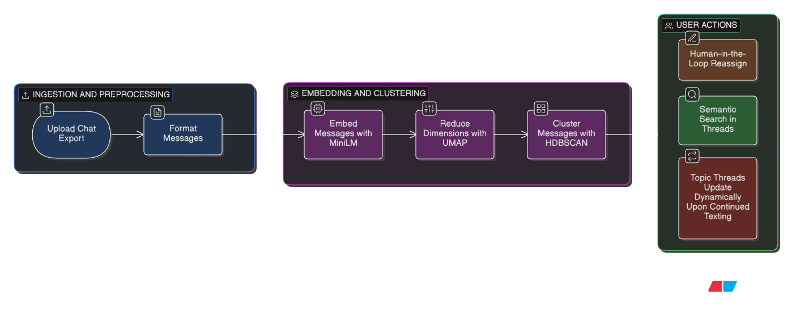
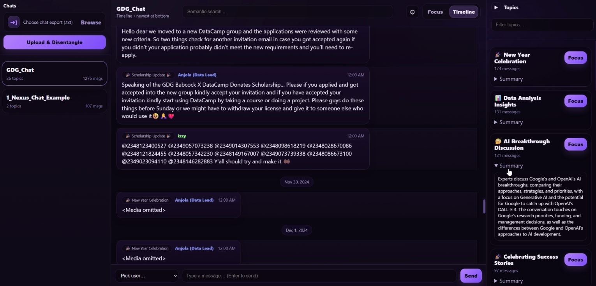
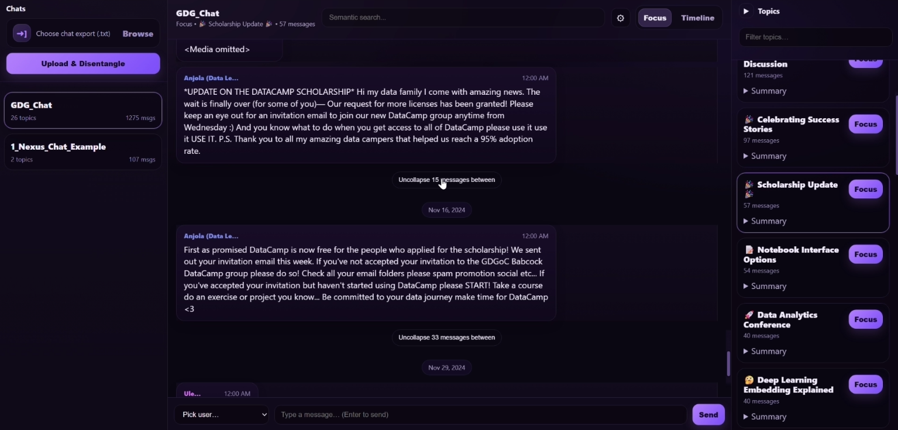
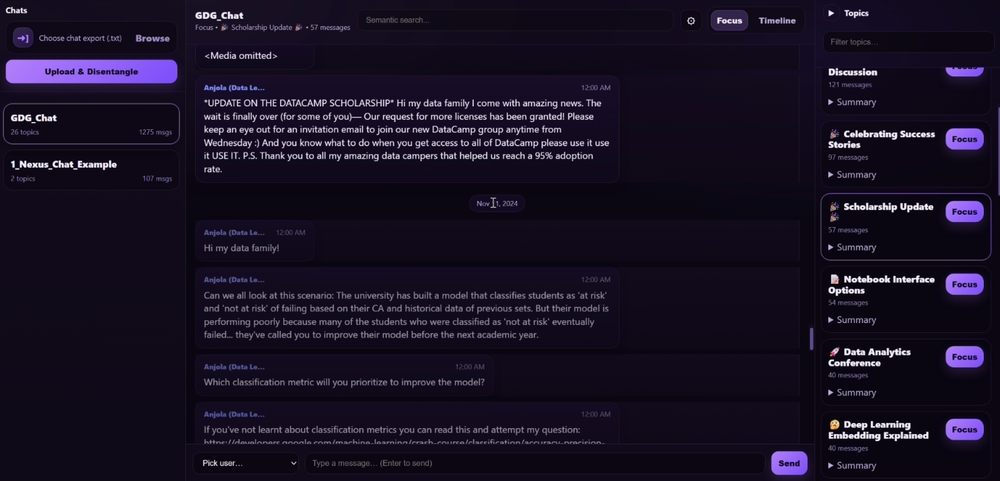
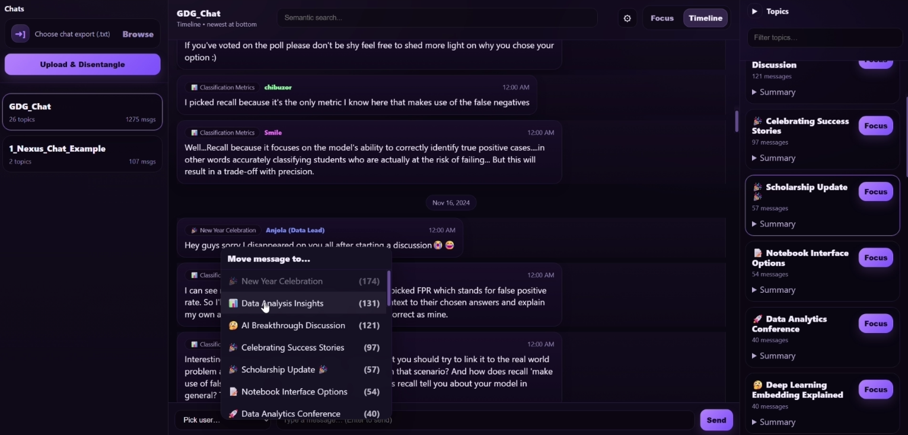
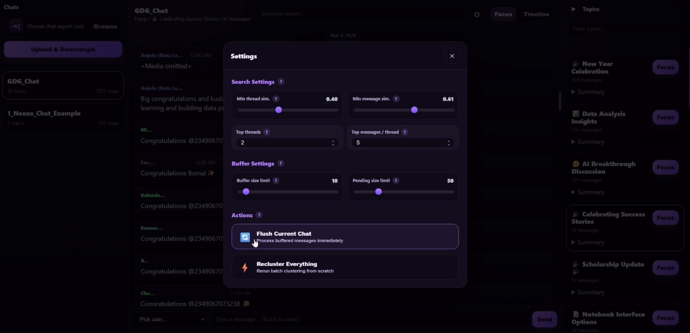

<p align="center">
  
</p>

# Nexus 🧠 **AI-Powered Chat Topic Disentanglement & Analysis**

Nexus is a local web application that turns chaotic linear group chats into structured, navigable topics. You upload a WhatsApp chat exports, and Nexus automatically splits the conversation into **topics (threads)**. You can then browse topics, read summaries, and switch between a full timeline view and a focused topic view.



---

## 🚀 Key Features

- **Topic Disentanglement:** Clusters scattered messages into coherent threads using semantic embeddings + `UMAP` + `HDBSCAN`.
- **Auto-Labeling:** Uses a local **Llama 3.2** model to generate readable topic titles and summaries.
- **Focus Mode:** Read a single topic thread while collapsing unrelated messages (with the option to expand gaps).
- **Timeline Mode:** View the chat chronologically as it happened.
- **Semantic Search:** Search your chat history by meaning, not just keywords.
- **Real-time Simulation:** A “Buffer & Flush” strategy assigns new messages quickly when confident, otherwise buffers for mini-clustering.
- **Human-in-the-loop refinement:** Manually reassign messages to topics — Nexus updates topic representations so future assignments and search results reflect your corrections.
- **Runtime controls (UI/API):** Adjust buffering and search strictness, and trigger **flush** or full **recluster** when needed.
- **Privacy First:** Runs **100% locally**. No data leaves your machine.

---

## 🏗️ Project Structure

```text
Nexus/
├── README.md
├── app.py                  # Main Flask application & API routes
├── utils.py                # Utilities for parsing WhatsApp timestamps/formats
├── requirements.txt        # Python dependencies
├── interface_example.ipynb # Jupyter notebook showcasing core logic
│
├── core/                   # Core logic module
│   ├── __init__.py
│   ├── interfaces.py       # Protocols (Formatter, Embedder, Clusterer, etc.)
│   ├── models.py           # Data classes (Message, Thread, Membership)
│   ├── processor.py        # Pipeline controller (batch + incremental ingestion)
│   ├── stores.py           # In-memory stores
│   └── strategies.py       # Implementations (MiniLM, UMAP, HDBSCAN, Buffer, Llama labeler)
│
├── data/chats/             # Example WhatsApp exports
└── persisted_chats/        # Cached processed chats (JSON/NPZ/PKL per chat_id)
```

---

## 🛠️ Installation

### Prerequisites

- **Python 3.10+**
- **RAM:** ~4GB minimum (for the local Llama 3B model; more is better)
- **Compiler toolchain** (needed for `llama-cpp-python`):
  - **Windows:** [Visual Studio Build Tools](https://visualstudio.microsoft.com/downloads/#build-tools-for-visual-studio-2022) (C++ workload)
  - **macOS:** Xcode Command Line Tools
  - **Linux:** `build-essential`

> If `llama-cpp-python` fails to build on your machine, Nexus can still run — topic clustering works, but auto-labeling may be disabled (you’ll see a warning in logs).

### 1) Create a virtual environment

**Windows (PowerShell)**

```powershell
py -3.10 -m venv .venv
.venv\Scripts\Activate.ps1
```

**macOS/Linux**

```bash
python3 -m venv .venv
source .venv/bin/activate
```

### 2) Install dependencies

```bash
pip install -r requirements.txt
```

**Optional (GPU):** The default installation runs on CPU and works out of the box. If you have an NVIDIA GPU and want faster processing, you can reinstall `llama-cpp-python` with CUDA support (refer to their documentation for the specific build flags).

### 3) Run the application

```bash
python app.py
```

Then open `http://127.0.0.1:5000`.

**First run downloads** -  Nexus may automatically download:
- the **MiniLM** embedding model (sentence-transformers)
- the **Llama-3.2-3B-Instruct** GGUF model (if enabled / not found)

---

## 📖 Usage

Either export a chat of your own or use example exports available in `data/chats/`.

### Exporting a WhatsApp chat

On WhatsApp (mobile):
1. Open the chat
2. Tap the menu (⋮) / chat info
3. Choose **Export chat**
4. Pick **Without media** (recommended)
5. Save/share the resulting `.txt` file
6. Upload it in Nexus

> **Note:** Steps may vary slightly between iOS/Android and WhatsApp versions.

### Processing and exploring your chat

1. **Open the UI:** `http://127.0.0.1:5000`
2. **Upload** the exported `.txt` file
3. **Wait for processing**
   - Parsing → Embedding → (UMAP) → Clustering → LLM labeling
4. **Explore**
   - **Left sidebar:** switch between uploaded chats
   - **Right sidebar:** browse topics + summaries
   - **Main view:** use **Focus Mode** or **Timeline Mode**
   - **Top center bar:**
     - **Settings:** tweak per-chat buffer limits and other runtime knobs
     - **Search:** run semantic search with adjustable thresholds
   - **Manual fixes:** right-click a message to reassign it to a different topic

### Focus Mode vs Timeline Mode

Nexus supports two ways to view a chat:

**Timeline Mode**
- Shows the full chat as it happened, in chronological order.
- Use it when you want the complete context of "what happened when".

**Focus Mode**
- Shows only the messages that belong to the selected topic.
- Messages from other topics are **collapsed**, with an option to **expand gaps** (unfold messages in between) when needed.
- This helps you follow one conversation thread without losing surrounding context.

---

## ⚙️ Configuration

Default pipeline parameters (like UMAP or HDBSCAN's hyperparameters) are defined in `app.py`. However, you can control runtime behaviors per chat via the UI/API:

- **Buffer sizes:** Adjust how many new messages are buffered before a mini-cluster is triggered.
- **Search thresholds:** Tweak the strictness of semantic search results.
- **Flush:** Force buffered messages to be processed immediately.
- **Recluster:** Wipe the current topic assignments and re-run the full batch pipeline from scratch.
- **Manual topic fixes:** Reassign a specific message to different topics via right-click — the system updates topic centroids so your corrections influence future assignments.

---

## 📸 Screenshots

### Timeline Mode
View the complete chat history in chronological order.



### Focus Mode
Follow a single topic thread (while collapsing unrelated messages).

**Collapsed view:**



**Expanded gaps:**



### Human-in-the-Loop Refinement
Manually reassign messages to different topics with a right-click.



### Semantic Search
Search by meaning, not just keywords.


### Runtime Settings
Adjust buffering, search thresholds, and trigger recluster or flush operations.



---

## 🛡️ Privacy

Nexus runs locally by default. Your chat exports and processed artifacts stay on your machine unless you deploy the server elsewhere.

---

## 📚 Authors

* Maya Rozenshtein
* Vsevolod Rusanov
